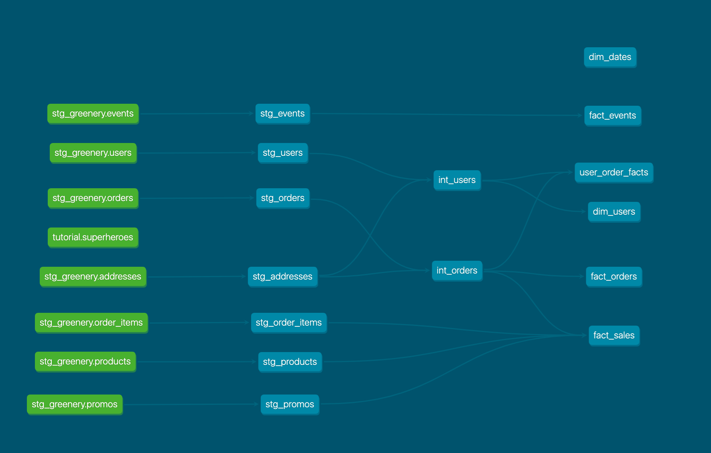

# Week 2 Exercises

## Part 1: Models
### User repeat rate 
What is our user repeat rate? 80%
```sql
with orders as (
    SELECT 
       user_id, 
      COUNT(DISTINCT order_id) as order_count,
      1 as user_count
    FROM "stg_orders" 
    WHERE created_at IS NOT NULL
    GROUP BY 1
) 

SELECT 100.0 * SUM(case when order_count >=2 then user_count else 0 end) / SUM(user_count) 
FROM orders
```
### Users that are likely to purchase again
**What are good indicators of a user who will likely purchase again?**
1. \# of previos purchases
2. Many events with intent (view pages, add to cart)
3. Purchased complementary goods recently
4. (In case a discount is given) User always purchases items with discount

**What about indicators of users who are likely NOT to purchase again?**
1. Long time since last purchase
2. Not many events with intent

**If you had more data, what features would you want to look into to answer this question?**
1. User preferences
2. User income level

### Intermediate models
I created a few intermediate models joining the addresses. I feel these could be joined both to a user as a dimension, representing the "main user address", as well as change at the order level as the "delivery address".

### Marts
#### Core
Key models that I expect to re-use across many functions
#### Marketing
A fact sales table that shows which items have been sold, which can be useful for marketing reporting.
A user order facts table to show key purchasing behavior of users.
#### Product
A fact events table for PMs to run usage analytics queries



### Tests
1. Added tests for uniqueness & non-null values to primary keys
2. Added other tests for positive values, in categorical variables, or positive values